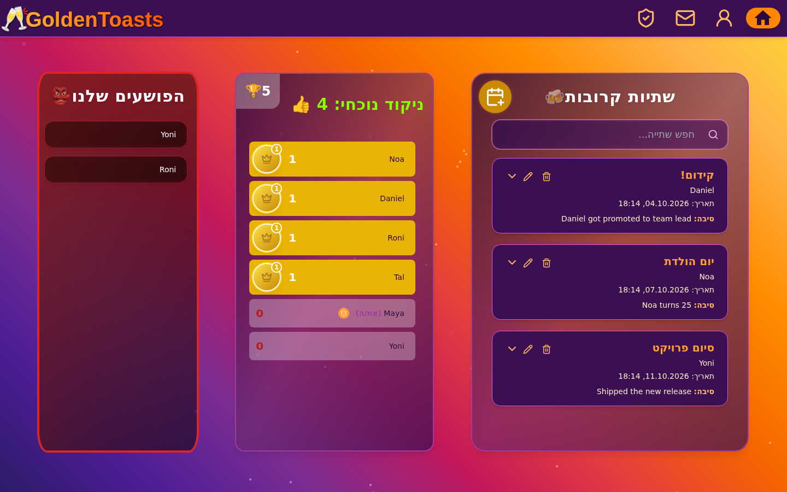
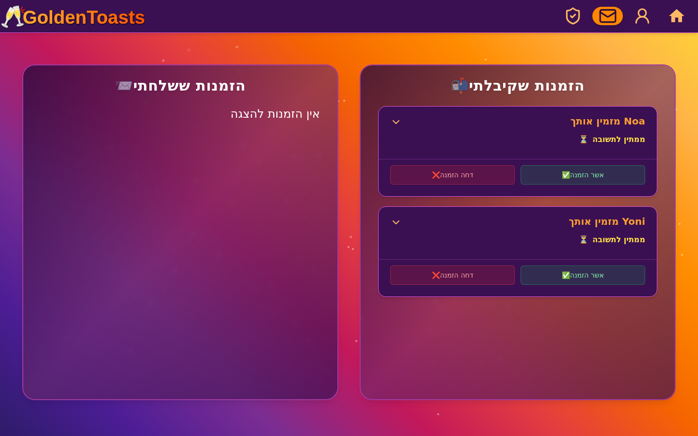
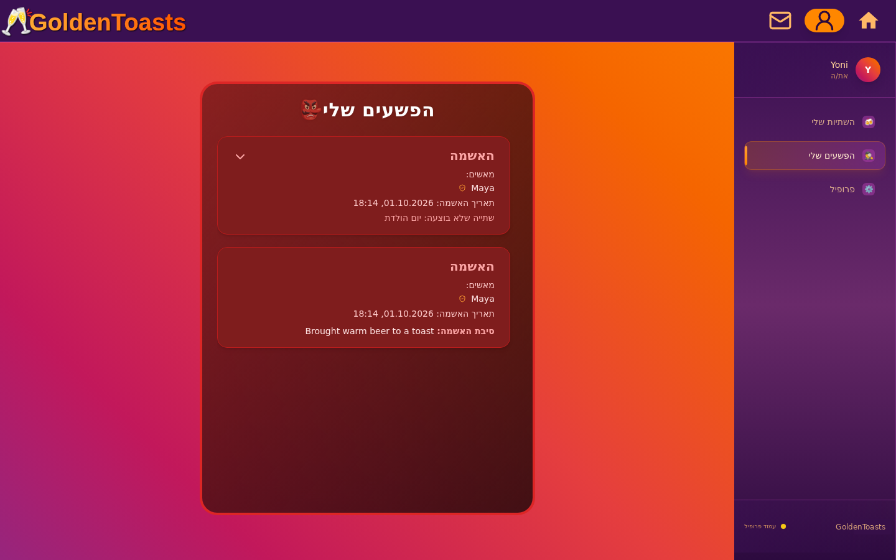
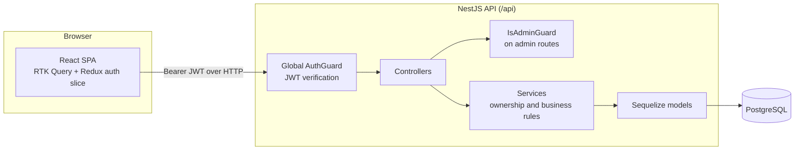

# GoldenToasts (Toasts & Criminals)

**A full-stack web app that runs a team's "toast" tradition: schedule toasts, invite colleagues, track who actually delivered, and publicly call out the ones who didn't.**

Built as an Nx monorepo with a **NestJS + PostgreSQL** REST API and a **React + Redux Toolkit** single-page app, with JWT authentication and role-based permissions.



> The UI is in Hebrew (right-to-left). Screenshots use fictional demo data.

---

## The concept

In this group, a **toast** is a small get-together that one member hosts to mark an occasion - a promotion, a birthday, finishing a project. The host picks a date, a place, and the food and drinks, and invites the others.

The app keeps everyone honest:

- **Toasts** - any member can schedule a toast, invite people, and edit or cancel it until its due time.
- **Invites** - invited members accept or decline. If the host moves the date, every invite goes back to "pending".
- **Admin approval** - once a toast's date has passed, it shows up in an admin queue, where an admin marks it as done.
- **Criminals** - admins can file an **accusation** against a member, either for a specific toast that never happened or for a free-text "crime". Members with accusations appear on the **criminals** board, ranked by number of accusations.
- **Scoreboard and record** - completed toasts are counted per half-year (January-June, July-December). The home screen shows each member's count for the current period, the period total, and the best half-year on record.
- **Persona non grata** - admins can flag a member, which shows an extra warning section on that member's accusations page.

## Features

| Area | What it does |
| --- | --- |
| Authentication | Sign-up and login with username and password. Passwords are hashed with bcrypt and must contain upper-case, lower-case and a digit. The API issues a JWT, and the client keeps it in a cookie. |
| Roles and permissions | A global guard protects every route that isn't marked public. An admin guard protects admin routes, and the services check ownership (for example, you can only edit your own toasts before their due time). |
| Toasts | Create a toast together with its invites in one request, edit or delete it, search the lists, and see the toasts you host or were invited to. |
| Invites | See the invites you received and sent, and accept or decline them. |
| Admin dashboard | A queue of past toasts waiting for approval, all toasts, and all users. Admins can promote or demote other admins and toggle a user's persona non grata flag. |
| Accusations | Admins file accusations linked to a toast or with a written reason. Members see their own accusations, and admins can see anyone's. |
| Profiles | "My toasts", "My crimes" and account settings (change username or password, delete account). Admins can open other users' profiles. |
| UX | Responsive RTL layout, loading skeletons, toast notifications (sonner), animations (framer-motion). |

<p align="center">
  
  
</p>

## Tech stack

**Backend** (`apps/backend`)
- [NestJS 11](https://nestjs.com/) (TypeScript), organized into feature modules: `auth`, `user`, `toast`, `invite`, `accusation`
- PostgreSQL through **Sequelize 6** with `sequelize-typescript` models
- JWT auth with `@nestjs/jwt`, and bcrypt password hashing (`bcryptjs`)
- Request validation with `class-validator` and a global `ValidationPipe` (whitelisting, rejection of unknown fields)
- Built with webpack through Nx

**Frontend** (`apps/frontend`)
- React 19 + Vite 6
- Redux Toolkit and **RTK Query** for API calls and cache invalidation
- React Router 7
- Tailwind CSS, Radix UI primitives (shadcn/ui-style components), MUI date pickers and icons, lucide icons
- framer-motion, sonner, date-fns

**Tooling**
- Nx 21 monorepo (`apps/` holds the two applications; `packages/` is reserved for shared libraries and is currently empty)
- ESLint 9 (flat config), Prettier, Jest (backend test runner)

## Architecture



- **Auth flow**: `POST /api/auth/login` (or sign-up via `POST /api/users`) returns a JWT that contains the user's id, username and admin flag. The client stores it in a cookie, decodes it to drive the UI (for example, to show the admin pages), and sends it as a `Bearer` token through RTK Query's `prepareHeaders`.
- **Authorization**: `AuthGuard` is registered as a global `APP_GUARD`. Routes marked `@Public()` skip it. Admin endpoints add `@IsAdmin()`. Per-resource rules, such as "only the host can invite to this toast" or "regular users can't edit a toast after its due date", are enforced in the services.
- **Errors**: a shared `handleError` helper logs errors with context and maps them to the right HTTP exceptions.

```
apps/
  backend/src/
    app/            root module (DB connection, global guard)
    config/         env-driven configuration (DB, JWT secret)
    modules/
      auth/         login, JWT, guards, @Public / @IsAdmin / @CurrentUser decorators
      user/         users, criminals ranking
      toast/        toasts, half-year counts, record, approval queue
      invite/       invites to toasts
      accusation/   accusations ("crimes")
    utils/          error handling, period calculation
  frontend/src/
    routes/         pages (home, invites, admin, profile, login, signup)
    components/     feature components + ui/ primitives
    store/          Redux store, auth slice, RTK Query API slices
    types/          shared TypeScript types
docs/
  API.md            full REST API reference
```

## Data model

| Entity | Key fields | Relations |
| --- | --- | --- |
| **User** | `username` (unique), `password` (bcrypt hash, never returned by the API), `isAdmin`, `isPersonaNonGrata`, `description` | creates many Toasts. Has many Invites. Reports and receives many Accusations. |
| **Toast** | `title`, `reason`, `dueDate`, `location` (enum) + `customLocation`, `foods[]`, `drinks[]`, `isDone` | belongs to its creator (User). Has many Invites. Can have one Accusation. |
| **Invite** | `isConfirmed` (`null` = pending, `true` = accepted, `false` = declined) | belongs to a Toast and an invited User. Unique per (toast, user). |
| **Accusation** | `reason` **or** `crimeToastId` (a model-level validator requires exactly one) | belongs to the accused User, the reporting User, and optionally the Toast that was never held |

The tables are created and updated automatically at startup (`synchronize: true`).

## API

The full list of routes, with permissions per role, is in **[docs/API.md](docs/API.md)**.

## Running locally

### Prerequisites
- Node.js 20+ and npm
- PostgreSQL (any recent version). With Docker:
  ```bash
  docker run --name toasts-db -e POSTGRES_PASSWORD=postgres -e POSTGRES_DB=toastsDB -p 5432:5432 -d postgres:16
  ```

### 1. Install dependencies
```bash
npm ci
```

### 2. Configure the backend
```bash
cp apps/backend/.env.example apps/backend/.env
```
Nx loads `apps/backend/.env` automatically when it runs backend targets.

| Variable | Default | Notes |
| --- | --- | --- |
| `PORT` | `3078` | The API is served at `http://localhost:<PORT>/api` |
| `JWT_SECRET` | dev-only fallback | **Required when `NODE_ENV=production`**: a private random value of 32+ characters (`openssl rand -hex 32`); otherwise the server refuses to start |
| `DB_HOST` / `DB_PORT` | `localhost` / `5432` | |
| `DB_USER` / `DB_PASSWORD` | `postgres` / `postgres` | |
| `DB_NAME` | `toastsDB` | The database must already exist. The tables are created automatically. |

### 3. Start both apps
```bash
npx nx serve backend    # http://localhost:3078/api
npx nx serve frontend   # http://localhost:4200
```
The frontend calls the API at `http://localhost:3078/api`. This URL is set in `apps/frontend/src/store/api/api.ts`.

### 4. Create an admin
Sign up through the UI. There is no UI for creating the first admin, so promote a user directly in the database:
```sql
UPDATE users SET "isAdmin" = true WHERE username = 'your-username';
```
Log out and back in so the new token includes the admin flag. From then on, admins can promote other users from the admin dashboard.

### Other commands
```bash
npx nx run-many -t build        # production builds -> dist/apps/*
npx nx run-many -t lint
npx nx run-many -t typecheck
npx nx run-many -t test
npx nx show project backend     # list every target of a project
```

## Status and roadmap

The app was built for a real team's tradition. Things I'd improve next:

- **Tests**: Jest is set up for the backend, but there are no test suites yet. The permission rules in the services are the first thing to cover.
- **Migrations**: replace `synchronize: true` with Sequelize migrations and a seed script.
- **Configuration**: read the frontend's API URL from an environment variable.
- **Auth hardening**: move the token to an httpOnly cookie and align the token lifetimes (the default is 1h, but login issues 30d tokens).

## Author

**Itschak Shteren** - [@IzikStar](https://github.com/IzikStar)
